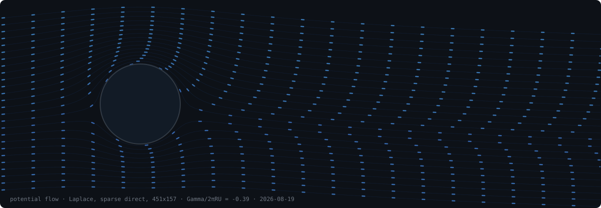

  

<h1 align="center">Tyler Jones</h1>

  <b>Engineering Services Intern @ Cadence</b> &nbsp;·&nbsp; <b>M.S. student @ UW–Madison</b> 

  
  
  

---

### About

TODO

---

### Selected Work

TODO

---

### Stats

  
  

---

<i>"Essentially, all models are wrong, but some are useful." — George Box</i>

